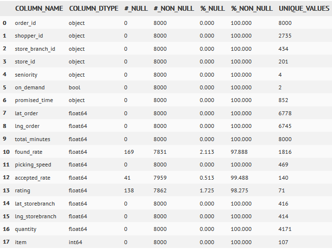
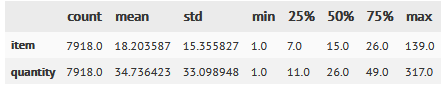

# Cornershop´s Data Science Test

## Abstract

In this case study, I developed a solution to predict how long a delivery order takes to be completed. The project was divided into several small steps, *e.g.* Data Handling and Understanding, Statistical Analysis, Exploratory Data Analysis, Preprocess and Modeling. I implemented four different models: Linear Regression as a Baseline Model, Support Vector Regressor and Boosting Models, and compared their results regarding the prdictions for the total time of completed deliveries. Moreover, I studied some possible combinations of engineering new features and fine-tuned the Champion Model using two different sets of resources.

The corresponding results are located at the folder [mvp](https://github.com/broilo/cornershop/tree/main/mvp) where:
1. **__preprocess.py** is a py-script with a class of functions associated with the data preprocess step
2. **mvp.py** is a another python-script which loads the dataset under prediction and performs the necessary data preprocessing. Moreover, this script also load the trainned model and predict the corresponding label/target values.
3. **20220403_outputs.csv** represents the predicted results. First column contains the order identification and the second (y_hat) is the corresponding order's prediction.

and the folder [notebooks](https://github.com/broilo/cornershop/tree/main/notebooks) contains ipynb's associated with those several small steps previously mentioned and properly documented. This folder also contains two outliers dictionary and the corresponding trained model **20220403_set4_XGBRegressor.sav** (XGBoost spolied!).

## First Things First: A brief introduction.

Online shopping represents a huge part of the sales market. And currently this model of business is bigger than it has ever been and most probably will keep growing more and more. During this last couple of years, the COVID-19 pandemic forced us to stay at home with little oportunities, or none, to go out and shopping. While retail market simply vanished at plain sight, the E-Commerce has grown. Food, medications, clothes... All sort of products, even supermarket deliveries! We're more connected than ever.

Cornershop has operations in several cities and countries, delivering thousands of orders every day. In order to deliver these orders on time Cornershop depends on good estimations of how much time the shopper needs to complete the order. The process of achieving this estimations presents many challenges. For example, missed product identification in an order or the lack of how much itens of this product the order contains.

## File description and data fields
***order_products.csv:***
- order_id: ID of the order
- product_id: ID of the product
- quantity: The quantity ordered of this product
- buy_unit: The unit of the product (KG/UN)

***orders.csv:***
- order_id: ID of the order
- lat: The latitude of the delivery location
- lng: The longitude of the delivery location
- promised_time: The delivery time promised to the user
- on_demand: If true, the order was promised to be delivered in less than X minutes
- shopper_id: ID representing the shopper completed the order.
- store_branch_id: ID of the store branch
- total_minutes: The total minutes it took to complete the order (label)

***shopper.csv***
- shopper_id: ID of the shopper
- seniority: The experience level of the shopper.
- found_rate: Percentage of products found by shopper historical.
- picking_speed: Historical picking speed, products pr minutes.
- accepted_rate: Percentage of orders historically accepted by shopper
- rating: client rating of shopper

***storebranch.csv:***
- store_branch_id: ID of the store branch
- store: ID representing the store
- lat: Latitude of the branch location
- lng: Longitude of the branch location

## [Data Merging](https://github.com/broilo/cornershop/blob/main/notebooks/part1_data_merging.ipynb)

The first part of the case study is associated with the data handlings and undertandig. For example, there're four different datasets all related within one another by means os some specific information. These data merging were performed as follws:

### Merge 1 $\to$ orders & shoppers

* **order_id**: primary key
* **shopper_id**: foreign key

        mg1 =  orders.merge(
            shopper,
            how='left',
            left_on=['shopper_id'],
            right_on=['shopper_id'])

### Merge 2 $\to$ mg1 & storebranch

* **order_id**: primary key
* **store_branch_id**: foreign key

        mg2 = mg1.merge(
            storebranch,
            how='left',
            left_on=['store_branch_id'],
            right_on=['store_branch_id'])

### Merge 3 $\to$ mg2 & order_products

* **order_id**: primary key
* **order_id**: foreign key

        mg3 = mg2.merge(
            order_products,
            how='left',
            left_on=['order_id'],
            right_on=['order_id'])

At the end, the process resulted into a single dataset with a cardinality of 198522 tuple/rows and a degree of 19 attributes/columns. 

**Notice that** there're orders identifications in the orders dataset that aren't in order_products dataset. Therefore, to take into account all order identifications, *i.e* all deliver orders, the correct join must be a left one.

### Dataset to train and test

This dataset were properly constructed by means of considering all orders associated with non-missing total minutes values (which is the label to be predited). Therefore, this dataset has a shape of 158325 rows and 19 columns.

### Dataset to predict: Simmulating the real world

Following the same logic as above, only with the difference that this dataset is associated with the missing values of the total minutes label columns. At the end, the corersponding shape is 40197 rows.

## [Statistical Analysis](http://localhost:8888/notebooks/Documents/Arbeit/Personal/projects/cornershop/notebooks/part2_analytical_record.ipynb)

The second part of this case project is associated with to consolidade the analytical record regarding the uderlying data information.

### Orders & Products information

The quantity resource corresponds to how much of a single product the order posses. *E.g* the maximum value found is of 70 and minimum is of 0.055. However, the values in it might be in the dimensions of "units of bits of products" (1,2,3,...) or a produtc's wight (1.7, 2.3, 3,...).

The above tables displays some basic stats regarding order products.

Notice that there're some missing values in quantity and buy_unit, which make sense because if there isn't a quantity there's no way of knowing its unit.

### Dataset's Macro View: Order Level

Let's analyze the order's level dataset, *i.e*. the deliveries infos summarized. 

        macro = df_tt[df_tt.columns].groupby(by=[
            'order_id',
            'shopper_id',
            'store_branch_id',
            'store_id',
            'seniority',
            'on_demand',
            'promised_time'
        ], as_index=False).agg(
            {
                'lat_order':['mean'],
                'lng_order':['mean'],
                'total_minutes':['mean'],
                'found_rate':['mean'],
                'picking_speed':['mean'],
                'accepted_rate':['mean'],
                'rating':['mean'],
                'lat_storebranch':['mean'],
                'lng_storebranch':['mean'],
                'quantity':['sum'],
                'item':['sum']
            }
        ).copy()

        macro.columns = macro.columns.droplevel(1)

The above table represents the describe macro-stats,

and in the next to tables depict some other information. 

Notice that there're missging entries in found_rate, accepted_rate and rating resources. The proper data manipulation associated with these nan's, *a.k.a.* Not A Number, will be properly handle in a forthcoming step.

## [Exploratory Data Analysis](http://localhost:8888/notebooks/Documents/Arbeit/Personal/projects/cornershop/notebooks/part3_eda.ipynb)

The third part of this case study is the data analysis associated with, *e.g.*, univariate analysis and info-tendencies and its correlated behavior with the target/label variable.

### Hypothesis

Let's start by formulating some hypotheses that might be interesting to guide us to tackle the underlying correlated information and to tame some possible misunderstandings associated with how some resource $X_{i}$ might affect the label $y$. In other words, given samples $P(X_{i}|y)$ estimates $P(y|X_{i})$.

## Univariate Analysis

### Resource: Quantity

* This resource is segmented in individual itens and also weigthed itens. 
* Therefore, it's a bit difficult to work with this resource without performing any change in it.
    1. **buy_unit** is the measure unit of the **quantity** resource
    1. **quantity** is simply how many "pieces of itens per products". But when grouped, it means the sum of all these pieces (either in units of UN or KG). Therefore, when grouped it can be interpreted as the total number of piecs of product itens per order.
    1. **item** is just a tracking resource, *i.e* is can be viewed as a way to identify the number of distinct products.

            quantityByUnit = df_tt[df_tt.buy_unit=='UN'][['order_id','item','quantity']].groupby(by=
                [
                    'order_id'
                ], as_index=False).sum(['item','quantity']).copy()

The discribe-stats are shwown bellow

Selecting by distinct unit, *i.e.*:

    quantityByUnit = df_tt[df_tt.buy_unit=='UN'][['order_id','item','quantity']].groupby(by=
        [
            'order_id'
        ], as_index=False).sum(['item','quantity']).copy()

    quantityByKg = df_tt[df_tt.buy_unit=='KG'][['order_id','item','quantity']].groupby(by=
        [
            'order_id'
        ], as_index=False).sum(['item','quantity']).copy()

Just by analyzing quantity by its repective units, it's easy to see that it leads to complete different values. The following figure displays the density distribution of quantity resource.

Notice that it's a left skewed distribution where the means is rougtly as 36 itens per order.

But let's dive a bit deeper in it...

#### Number of itens and distinct items per order

* Calculating **no_itens**: the number of type of itens per order
    * *i.e*, when **buy_unit** is UN, then number of type of itens is exactly it's quantitiy, else it's zero or null.
* Calculating **weight**: the weight of the quantity with units of KG
    * Not a good resource...

The number of itens distribution is a left skewed one if mean roughly as 36 itens per order. Therefore, quantity and no_item are basically the same information, and most probably there's a correlation almost one-to-one between them.

On the other hand, the number of distinct itens is about 20 per order, and it's also a left skewd distribution. Therefore, although quantity and distinct might be correlated, in some aspect they can contribute with underlying different aspects of the same information.

### Datetime resource: promised_time

* **promised_time** means the deliver time which was previously promised to the user
* let's expand this datetime resource in its components

#### day_of_week

1. [0, 1, 2, 3, 4, 5, 6, 7]
1. [Monday, Tuesday, Wednesday, Thursday, Friday, Saturday, Sunday]

The **promised_time** (day of week) for the deliveries are all Friday, Saturday and Sunday:
* $29.08\%$ on Fridays
* $70.91\%$ on Saturdays
* $0.0125\%$ on Sundays

The created resource **pure_time** means simply the time as a pure number, *e.g* 13.5 is 13h30min.

* Most probably this is an odd behavior for deliveries
    1. For **promised_time** less than 5 a.m. and also greater than 20-21 p.m.

Moreover
* 2019-10-19: 118964 entries
* 2019-10-18: 39323 entries
* 2019-10-20: 38 entries

All data corresponds to a range-date of 3 days.
1. Where only one **promised_time** was set for Sunday (2019-10-20)
1. Which is another odd behavior

### Rating plus speed resources: found_rate, accepted_rate, rating

* **found_rate** is the percentage of products found by shopper historical.
* **accepted_rate** is the percentage of orders historically accepted by shopper
* **rating** means the client rating of shopper

**Notice that:**
* **found_rate** has a quasi-normal shape (gaussian), for this reason we could say that around $68\%$ can be found in the shopper historical witha a found rate interval of $[\mu-\sigma, \mu+\sigma] = [0.83, 0.89]$
* **accepted_rate** and **rating** are too much left skewed
    1. which in fact makes sense, because most of the order must be accecpted by the shopper, otherwise their rating would be low
    1. however, most of the rating are between 4.8 - 5.0
    1. most probably there's a strong correlation between these two resources
* On the other hand, **picking_speed** is right skewed

### Resource: on_demand

* $45.5\%$ of the orders were promised to be delivered in less than X minutes
* $54.5\%$ otherwise

### Distance Resource

Since there're coordinates resources:
* **lat**: The latitude of the delivery location
* **lng**: The longitude of the delivery location
* **lat**: Latitude of the branch location
* **lng**: Longitude of the branch location

Therefore, the distance between shopper and deliver location can be calculated.

This left skewd distribution shows that most users probably lives near by the branch location

* Probably most of the customers are locals, *i.e.* they live near by the shoppers
* However, there are a few in a **distance** greater than 10 km

### Resource: seniority

* **seniority** is the experience level of the shopper

Percentage of each seniority:
1. 6c90661e6d2c7579f5ce337c3391dbb9:    $61.3\%$
1. 50e13ee63f086c2fe84229348bc91b5b:    $22.4\%$
1. 41dc7c9e385c4d2b6c1f7836973951bf:    $15.1\%$
1. bb29b8d0d196b5db5a5350e5e3ae2b1f:    $1.3\%$

### Target Analysis: total_minutes

The target distribution is a very smooth right skewed with mean around 81 minutes.

## Bivariate Analysis

### Quantity VS target

**Hypothesis 1:** More products ordered imply more time to complete the order $\to$ **Accepted**

### Distance VS target

**Hypothesis 2:** The farthest the customer is than more time to complete the order $\to$ **Accepted**

**Hypothesis 9:** The farthest the branch is than more time to complete the order $\to$ **Accepted**

### on_demand VS target

**Hypothesis 3:** If the order is on demand than lesser time to complete the order $\to$ **Accepted**

### seniority VS target

**Hypothesis 4:** High seniority implies less time to complete the order $\to$ **Rejected**

### found_rate VS target

The tie-label corresponds to missing values.

**Hypothesis 5:** High found rate implies less time to complete the order $\to$ **Rejected**

### picking_speed VS target

**Hypothesis 6:** High picking speed implies less time to complete the order $\to$ **Rejected**

### accepted_rate VS target

The tie-label corresponds to missing values.

**Hypothesis 7:** High accepted rate implies less time to complete the order $\to$ **Rejected**

### rating VS target

The tie-label corresponds to missing values.

**Hipotheses 8:** High rating implies less time to complete the order $\to$ **Rejected**

## Correlation Analysis

### Pairwise analysis

**Please check the corresponding figure in the notebook**

* Fot the majority of resources the pairwise plot didn't show a "preferred direction". 
* Regarding the quantity, item and no_item resources the presence of a preferred directions is simply because the three resource means basically the same info. 
* However there's a slightly pairwise correlation between quantity VS total_minutes (which is the Hypothesis 1)

### Cross-correlation Analysis

First, it will be necessary to apply an encoding to categorical variables, in addition to transforming variables with more than one categories

**Please check the corresponding figure in the notebook**

## Hypothesis Conclusion

 
Notice that only four out of nine hypotheses were accepted.  On the other hand, this result doesn't necessary imply that the rejected ones won't play an important part when predicting the label.

# [Preprocess](http://localhost:8888/notebooks/Documents/Arbeit/Personal/projects/cornershop/notebooks/part4_preprocess.ipynb)

The fouth part is associated with all those findings during the EDA step and that now will be properly applied into the dataset.

## Replace Missing Values

### Resources
1. found_rate
1. accepted_rate
1. rating
1. quantity

In order to avoid removing missing entries, I'll simply replace it by some value. In this case I chose to replace them by the corresponding resource median, because median is less affected by possible outlier values.

## Feature Engineering

### Resources Created
1. day_of_week: associated with the promise_time
1. pure_time: associated with the promise_time
1. distance: associated with latitude and longitude from the branch and  delivery location
1. no_items: associated with quantity
1. weight: associated with quantity
1. item: associated with quantity

## Outlier Analysis

### Turkys' Interquartile Method

* The only resource I'll will adjust is the **pure_time**
    1. all values lesser than 10 will be freezed at percentile 0.25
    1. all values grater than 21 will be freezed at percentile 0.75
* Simply because 10h to 21h is period of time that makes sense for deliveries.

### Percentile-Freeze

Around 1999 entries were related to pure_time valeus greater than 20.67h and around 1896 lesser than 15h. Therefore for any given pure_time value greater than 20.67 or lesser than 15, they were freeze in precisely this values, which corresponds to the 0.75 and 0.25 percentile, respectively.

# [Model](http://localhost:8888/notebooks/Documents/Arbeit/Personal/projects/cornershop/notebooks/part5a_model_default.ipynb)

The fifth part is associated with the model's train and evaluation.
## Splitting Train/Test data: 80/20
The dataset which was set aside to simmulate an input data from the real world was actualy 20% from the initial full-merged dataset. For this reason I decided to split the train/test data into 80/20, so keeping the initial imbalanced size.

Moreover, I also tested four different sets of feature combination, by taking into account the created resources and some of the finding results from the hypothesis testing:

    features = [
        'seniority_41dc7c9e385c4d2b6c1f7836973951bf',
        'seniority_50e13ee63f086c2fe84229348bc91b5b',
        'seniority_6c90661e6d2c7579f5ce337c3391dbb9',
        'seniority_bb29b8d0d196b5db5a5350e5e3ae2b1f',
        'on_demand',
        #day_of_week,
        'pure_time',
        'found_rate',
        'picking_speed',
        'accepted_rate',
        'rating',
        'distance',
        'no_item',
        'quantity',
        'item'
    ]

    features_set1 = list(df[features].drop(columns=['no_item','item']))
    features_set2 = list(df[features].drop(columns=[
        'seniority_41dc7c9e385c4d2b6c1f7836973951bf',
        'seniority_50e13ee63f086c2fe84229348bc91b5b',
        'seniority_6c90661e6d2c7579f5ce337c3391dbb9',
        'seniority_bb29b8d0d196b5db5a5350e5e3ae2b1f' 
    ]))
    features_set3 = list(df[features].drop(columns=['rating','no_item','item']))
    features_set4 = features

## Models Tested

1. Baseline: Linear Regressor
1. Support Vector Regressor
1. XGBoost
1. CatBoos

In orer just to start tackling the prediction problem, I chose to only work with its default version, *i.e.* Parameters and Hyperparameters loaded with its default values.

The following tables summarize the results by taking into account some metrics for fit-quality and loss function.

The best results were obtained by means of Set 2 and 4:

The loss function by model per set (root mean square error) are depicted in the above picture.

Notice that the CatBoost regressor shows the lowest rmse-value, but XGBoost also presents a low rmse-value (around $3\%$ greater than the CatBoost in Set 2 and $4\%$ grater in Set 4).

The following picture displays the fit-quality (goodness-of-fit) by considering the four different sets. Notice that this metrics simply means how much variance the model can indeed explain. 

Notice that CatBoost has the largest values of goodness-of-fit, around $6\%$ greater than XGBoost by considering Set 2 and $8\%$ greater in Set 4.

However, since I didn't quite understand what actualy happened with CatBoost1 train score, I decided to fine-tune the XGBoost regressor isntead of  CatBoost, more specifically taking into account the features' set 2 and 4.

# [Fine-Tune](http://localhost:8888/notebooks/Documents/Arbeit/Personal/projects/cornershop/notebooks/part5b_model_xgboost.ipynb) and [Predict](http://localhost:8888/notebooks/Documents/Arbeit/Personal/projects/cornershop/notebooks/part6_mvp.ipynb)

The last, but not least part of the case study is the model's fine-tune process and the label prediction. This corresponds to the minimal viable product (mvp) to be delivered.

## XGBoost Regressor: Random Search

    model = xgb.XGBRegressor()

    params = {
        "colsample_bytree": uniform(0.7, 0.3), #default=1
        "gamma": uniform(0, 0.5), #default=0
        "learning_rate": uniform(0.03, 0.3), # default=0.3
        "max_depth": randint(2, 6), # default=6
        "n_estimators": randint(100, 150), # default=100
        "subsample": uniform(0.6, 0.4), # default=1
    }

    search = RandomizedSearchCV(
        model, 
        param_distributions=params, 
        random_state=SEED, 
        n_iter=200, 
        cv=3, 
        verbose=1, 
        n_jobs=1, 
        return_train_score=True
    )

TO BE CONTINUED...
